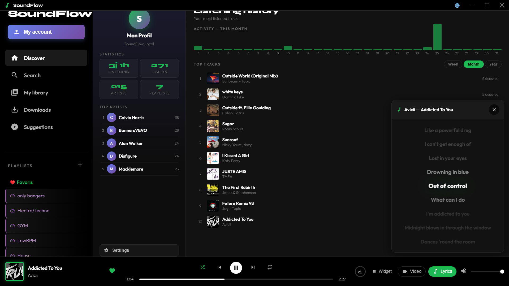

# 🎵 SoundFlow

Un lecteur de musique gratuit, open-source et sans limites pour Windows.

SoundFlow te permet d'écouter et de télécharger ta musique préférée sans 
publicité, sans abonnement et sans restriction ! Une alternative libre 
aux plateformes de streaming classiques, pensée pour rester simple, 
rapide et 100% gratuite.

## 📥 Installation

1. Télécharge le fichier `.zip` depuis la [dernière version](https://github.com/raphaelhelena1-art/Soundflow/releases/latest)
2. Décompresse le dossier
3. Lance le fichier `.exe`

C'est tout, aucune installation supplémentaire n'est nécessaire ! Il ne vous reste plus qu'à profiter 🎶

## ✨ Fonctionnalités

- 🎧 Lecture audio fluide et illimitée
- 📥 Import et téléchargement de musique intégré
- 🎬 Lecture de clips vidéo
- 🚫 Aucune publicité, jamais
- 💸 Totalement gratuit, sans abonnement
- 🎨 Interface simple et intuitive, inspirée des meilleures apps de streaming
- 🔓 Open-source — le code est ouvert à tous

## 💬 Retours & suggestions

C'est la toute première version de SoundFlow ! Si vous avez des bugs à signaler, 
des idées d'amélioration ou des fonctionnalités à proposer, ouvre une 
[issue](https://github.com/raphaelhelena1-art/Soundflow/issues) — tous les 
retours sont les bienvenus 🙌

## 📄 Licence

Ce projet est sous licence [MIT](LICENSE) — libre à vous de l'utiliser, 
le modifier et le redistribuer.
